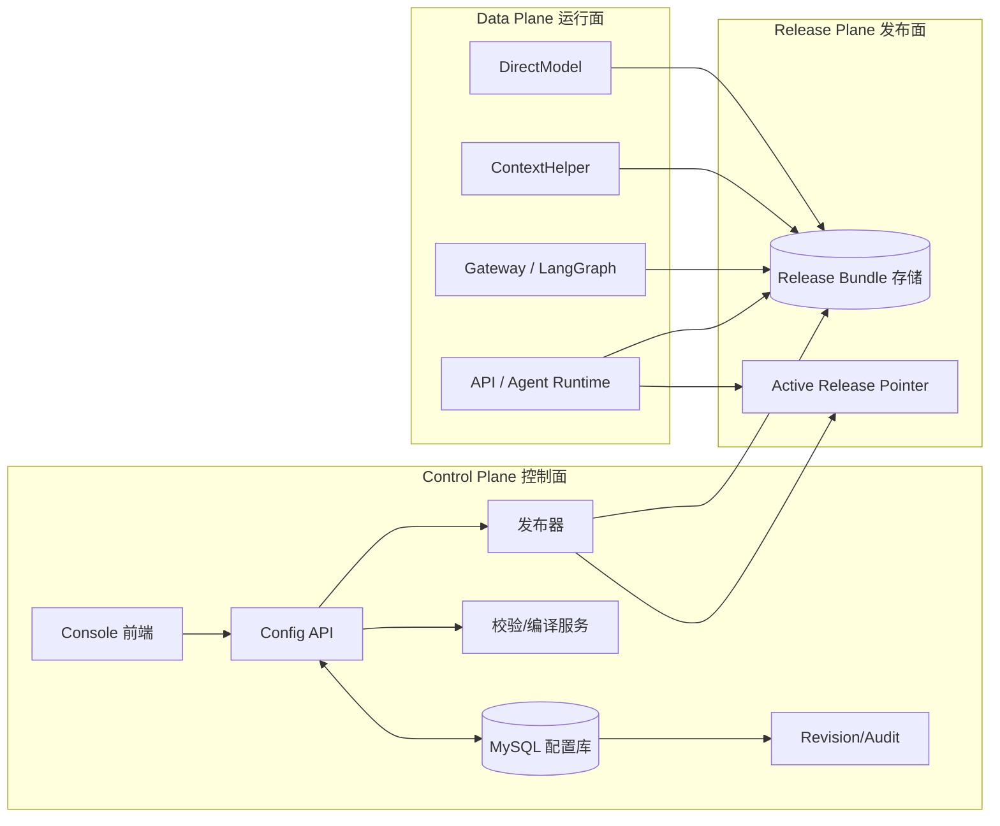

# MySQL 配置中心化改造系统架构与任务清单

## 1. 文档目的

本文档用于指导将当前“文件式配置中心”改造为“**MySQL 作为配置中心主存储，发布生成 release bundle，运行时读取已发布 bundle**”的生产级方案。

本文档面向两类执行者：

- 人工研发实施
- AI 编码代理按步骤执行改造任务

本文档重点不是只描述“存储从文件切到数据库”，而是给出一套**可上线、可回滚、可审计、可渐进迁移**的完整方案。

---

## 2. 当前系统现状

### 2.1 当前配置内容存放位置

当前仓库中的配置中心内容主要分散在以下目录：

- `scene-configs/*.json`
- `platform/skills/*.yaml`
- `platform/tools/*.yaml`
- `platform/templates/*.yaml`
- `runtime-assets/openclaw/workspace/skills/**/references/*`
- `metadata/*.tsv`
- `ContextHelper/generated-queries/*`

### 2.2 当前关键加载链路

当前运行时强依赖本地文件，主要入口如下：

- 场景配置加载：
  - `services/scene-config.js`
- 平台资源注册表加载：
  - `platform/compiler/validate.js`
- QueryProfile 运行时加载：
  - `services/generic-query-runner.js`
- prompt/schema/dictionary/rules 运行时加载：
  - `platform/nodes/load-assets.js`
- direct-model 资产加载：
  - `services/direct-model.js`
- 控制台配置读写：
  - `services/console-scenes.js`
  - `services/console-configs.js`
- API 入口：
  - `routes/agent.js`
- ContextHelper 生成查询脚本：
  - `ContextHelper/services/generated-query-file.js`

### 2.3 当前架构问题

当前基于本地文件的配置中心存在以下问题：

- 缺少统一 Source of Truth
- 草稿与生效版本混在一起
- 发布与回滚不可控
- 多实例环境难以保持一致
- 控制台直接写文件，不适合生产权限治理
- 审计链、版本链不完整
- runtime 对绝对路径与本地文件结构耦合较深

---

## 3. 目标架构

### 3.1 总体原则

生产方案采用以下原则：

1. **MySQL 作为配置中心唯一真源（Source of Truth）**
2. **编辑态与生效态分离**
3. **发布生成 release bundle**
4. **运行时只读取已发布 bundle**
5. **请求热路径不直接查配置库**
6. **支持版本审计、原子发布、一键回滚**

### 3.2 目标架构图



### 3.3 三层职责定义

#### Control Plane

职责：

- 管理草稿配置
- 提供控制台读写接口
- 进行配置校验、编译预览
- 发起发布与回滚
- 保存 revision / audit

#### Release Plane

职责：

- 把草稿配置固化为发布版本
- 生成完整 release bundle
- 切换 active release pointer
- 保证发布与回滚原子性

#### Data Plane

职责：

- 只读取已发布 bundle
- 不直接消费草稿
- 不在请求路径中访问 MySQL 配置库

---

## 4. 改造范围与非目标

### 4.1 本次改造范围

纳入 MySQL 配置中心管理的对象：

- scene config
- BusinessSkill
- WorkflowTemplate
- ToolDefinition
- QueryProfile
- prompt
- schema
- dictionary
- rules
- helper query script
- revision / release / rollback / audit

### 4.2 非目标

以下内容不纳入本次 MySQL 配置中心：

- `node_modules`
- 前端构建产物 `dist`
- 普通运行日志
- 请求调试快照
- 图片、附件、二进制资产
- 业务数据库表数据（如 `t_sales_opportunity`）

---

## 5. 发布与回滚定义

### 5.1 发布什么

发布的不是代码，而是某个场景或某组资源的**生效配置快照**。

推荐以“场景 bundle”作为发布粒度。以 `sales-opportunity-smart-entry` 为例，一次发布至少包含：

- scene config
- BusinessSkill
- QueryProfile
- prompt
- schema
- dictionary
- rules
- helper query script

### 5.2 回滚什么

回滚的是“当前线上生效版本指针”，不是人工把文件一项项改回去。

例如：

- 当前生效版本：`rel_20260416_001`
- 回滚目标版本：`rel_20260415_003`

回滚操作的本质是将 active pointer 从当前版本切换为旧版本。

---

## 6. MySQL 表设计

## 6.1 设计原则

- 原始文本与解析后 JSON 同时保存
- 保留统一唯一键
- revision 与 release 独立建模
- 支持草稿态与发布态分离

## 6.2 表清单

### 6.2.1 `cfg_scene_configs`

用途：保存场景配置当前草稿。

建议字段：

- `id` bigint pk
- `scene` varchar(128) not null
- `title` varchar(255) not null
- `enabled` tinyint not null
- `execution_mode` varchar(64) not null
- `status` varchar(32) not null default 'draft'
- `document_json` json not null
- `source_text` longtext not null
- `checksum` varchar(64) not null
- `current_revision_id` bigint null
- `updated_by` varchar(128) null
- `updated_at` datetime not null

约束：

- `unique(scene)`

### 6.2.2 `cfg_platform_resources`

用途：保存 skill / template / tool / query 当前草稿。

建议字段：

- `id` bigint pk
- `kind` varchar(32) not null
- `name` varchar(128) not null
- `version` varchar(64) not null
- `ref` varchar(255) null
- `scene` varchar(128) null
- `status` varchar(32) not null default 'draft'
- `document_json` json not null
- `source_text` longtext not null
- `checksum` varchar(64) not null
- `current_revision_id` bigint null
- `updated_by` varchar(128) null
- `updated_at` datetime not null

约束：

- `unique(kind, name, version)`
- `unique(ref)` where ref is not null

### 6.2.3 `cfg_scene_assets`

用途：保存 prompt / schema / dictionary / rules 当前草稿。

建议字段：

- `id` bigint pk
- `scene` varchar(128) not null
- `asset_type` varchar(32) not null
- `ref` varchar(255) null
- `content_text` longtext not null
- `content_format` varchar(32) not null
- `checksum` varchar(64) not null
- `status` varchar(32) not null default 'draft'
- `current_revision_id` bigint null
- `updated_by` varchar(128) null
- `updated_at` datetime not null

约束：

- `unique(scene, asset_type)`

### 6.2.4 `cfg_helper_scripts`

用途：保存 helper query script 草稿。

建议字段：

- `id` bigint pk
- `scene` varchar(128) not null
- `script_type` varchar(64) not null
- `script_name` varchar(255) not null
- `content_text` longtext not null
- `checksum` varchar(64) not null
- `status` varchar(32) not null default 'draft'
- `current_revision_id` bigint null
- `updated_by` varchar(128) null
- `updated_at` datetime not null

约束：

- `unique(scene, script_type)`

### 6.2.5 `cfg_revisions`

用途：记录每次草稿改动的历史版本。

建议字段：

- `id` bigint pk
- `target_type` varchar(64) not null
- `target_id` bigint not null
- `revision_no` int not null
- `source_text` longtext not null
- `document_json` json null
- `checksum` varchar(64) not null
- `operator` varchar(128) null
- `change_note` varchar(500) null
- `created_at` datetime not null

约束：

- `unique(target_type, target_id, revision_no)`

### 6.2.6 `cfg_releases`

用途：记录每次发布。

建议字段：

- `id` bigint pk
- `release_id` varchar(128) not null
- `environment` varchar(64) not null
- `scope_type` varchar(32) not null
- `scope_value` varchar(255) not null
- `status` varchar(32) not null
- `manifest_json` json not null
- `bundle_path` varchar(1000) not null
- `created_by` varchar(128) null
- `publish_note` varchar(500) null
- `created_at` datetime not null
- `published_at` datetime null

约束：

- `unique(release_id)`

### 6.2.7 `cfg_release_entries`

用途：记录某次发布快照中包含的每一个对象。

建议字段：

- `id` bigint pk
- `release_id` varchar(128) not null
- `entry_type` varchar(64) not null
- `entry_key` varchar(255) not null
- `target_id` bigint not null
- `revision_id` bigint not null
- `snapshot_text` longtext not null
- `snapshot_json` json null
- `checksum` varchar(64) not null

索引：

- `index(release_id)`

### 6.2.8 `cfg_release_pointers`

用途：保存某环境、某范围当前生效版本指针。

建议字段：

- `id` bigint pk
- `environment` varchar(64) not null
- `scope_type` varchar(32) not null
- `scope_value` varchar(255) not null
- `active_release_id` varchar(128) not null
- `previous_release_id` varchar(128) null
- `updated_by` varchar(128) null
- `updated_at` datetime not null

约束：

- `unique(environment, scope_type, scope_value)`

---

## 7. Release Bundle 设计

### 7.1 核心原则

第一阶段不强行把运行时改成直接查 MySQL，而是采用：

**MySQL 主存储 + 发布物化成 bundle + 运行时读 bundle 文件**

### 7.2 推荐目录结构

```text
runtime-bundles/
  local/
    rel_20260416_001/
      manifest.json
      scene-configs/
        sales-opportunity-smart-entry.json
      platform/
        assets/
          prompts/
        skills/
        tools/
        templates/
      metadata/
      references/
        payment-info-split/
      runtime-assets/
        openclaw/
          workspace/
            skills/
              sales-opportunity-smart-entry/
                references/
      ContextHelper/
        generated-queries/
          sales-opportunity-smart-entry.generated.js
          manifest.json
      DirectDbRunner/
        sql-cache/
    current -> rel_20260416_001
```

说明：

- `current` 所指向的目录建议保持“**自包含 project root 镜像**”结构。
- 这样后续切换到 bundle 时，`project://...` 可以解析到 bundle current 根目录，`runtime://openclaw/...` 可以解析到 bundle current 下的 `runtime-assets/openclaw/...`，避免遗漏当前基线依赖。
- 详细规范见 `MySQL配置中心化改造Bundle与环境变量规范.md`。

### 7.3 bundle manifest 必须包含

- `release_id`
- `environment`
- `scope_type`
- `scope_value`
- `created_at`
- `entries`
- `checksums`
- `renderer_version`

---

## 8. 运行时读取策略

## 8.1 第一阶段运行原则

运行时不直接查 MySQL，而是读取 active bundle。

### 8.2 运行时配置入口

建议新增环境变量：

- `CONFIG_BUNDLE_ROOT`
- `CONFIG_ACTIVE_ENV`

运行时先推导：

- `CONFIG_CURRENT_BUNDLE = ${CONFIG_BUNDLE_ROOT}/${CONFIG_ACTIVE_ENV}/current`
- `CONFIG_PROJECT_ROOT = ${CONFIG_CURRENT_BUNDLE}`
- `CONFIG_RUNTIME_ROOT = ${CONFIG_CURRENT_BUNDLE}/runtime-assets`

运行时再从如下路径读取：

- `${CONFIG_CURRENT_BUNDLE}/scene-configs`
- `${CONFIG_CURRENT_BUNDLE}/platform`
- `${CONFIG_CURRENT_BUNDLE}/runtime-assets`
- `${CONFIG_CURRENT_BUNDLE}/ContextHelper/generated-queries`

当前基线额外要求 bundle current 中同时保留：

- `${CONFIG_CURRENT_BUNDLE}/metadata`
- `${CONFIG_CURRENT_BUNDLE}/references`
- `${CONFIG_CURRENT_BUNDLE}/DirectDbRunner/sql-cache`

### 8.3 好处

- 请求热路径不依赖 MySQL 配置库
- 多实例只需同步 bundle 与 pointer
- 发布与回滚可以秒级生效
- 保持与当前文件读取逻辑兼容

---

## 9. 改造总策略

## 9.1 总体路线

### Phase 1

MySQL 做主存储，控制台改为操作 MySQL 草稿；运行时仍读取 bundle 文件。

### Phase 2

发布器上线，支持生成 bundle、切 active release、回滚到旧版本。

### Phase 3

运行时逐步从“直接读仓库文件”切换到“读 active bundle”。

### Phase 4（可选）

如果后续需要，再进一步把部分运行时改为直接读数据库缓存层，但不作为本次改造前置条件。

---

## 10. 仓储抽象层设计

必须先加统一仓储接口，禁止直接在上层业务里继续散落 `readFile/writeFile`。

建议新增：

- `services/config-store/index.js`
- `services/config-store/file-store.js`
- `services/config-store/mysql-store.js`

统一接口建议如下：

- `getSceneConfig(scene)`
- `listSceneConfigs()`
- `loadPlatformResources()`
- `getSceneAsset(scene, assetType)`
- `saveSceneAsset(scene, assetType, content, operator)`
- `getQueryProfile(ref)`
- `savePlatformResource(kind, name, version, payload, operator)`
- `createRevision(...)`
- `createRelease(...)`
- `publishRelease(...)`
- `rollbackRelease(...)`

---

## 11. 分阶段任务清单

以下任务清单以“最稳、最容易回退”为优先目标。

### 11.0 顺序执行规则

为了让 AI 可以持续、稳定地按顺序推进，本文件中的任务说明保留为“主说明文档”，实际执行状态与逐项推进请统一维护在以下两个配套文件中：

- `MySQL配置中心化改造执行看板.md`
- `AI顺序执行改造任务指令.md`

执行约定如下：

1. AI 必须先读取执行看板，再开始实施
2. AI 必须从上到下扫描任务总表
3. AI 每次只执行从上到下找到的第一个未完成任务
4. 如果该未完成任务状态为 `BLOCKED`，AI 不得跳过，必须先返回阻塞原因
5. AI 完成任务后，必须回写执行看板中的状态、结果记录、验证结果
6. 没有更新执行看板状态的任务，视为未完成

## Phase 0：基线冻结与预备

### T0-01 冻结当前文件布局与运行基线

目标：

- 冻结当前可运行状态
- 记录当前所有关键路径依赖

动作：

- 记录以下目录为 baseline：
  - `scene-configs`
  - `platform`
  - `runtime-assets/openclaw/workspace`
  - `ContextHelper/generated-queries`
- 补一份当前场景运行清单：
  - `payment-info-split`
  - `sales-opportunity-advisor`
  - `sales-opportunity-smart-entry`
  - `sales-opportunity-advisor-directdb`

验收：

- 能列出每个场景当前生效配置来自哪些文件

### T0-02 建立 bundle root 与环境变量规范

目标：

- 明确未来运行时从哪里加载 bundle

动作：

- 增加环境变量设计：
  - `CONFIG_BUNDLE_ROOT`
  - `CONFIG_ACTIVE_ENV`
- 约定本地开发和生产目录布局

验收：

- 文档中给出开发 / 测试 / 生产三套路径规范

### T0-03 准备 MySQL 环境

目标：

- 为配置中心改造准备可用的 MySQL 实例
- 明确开发、测试、生产的数据库承载方式

动作：

- 本地开发环境：
  - 安装 MySQL，或使用 Docker 启动 MySQL 实例
- 测试 / 生产环境：
  - 申请或创建托管 MySQL / RDS 实例
- 明确版本要求、字符集、时区、网络访问方式

约束：

- 生产环境优先采用托管数据库，而不是手工在业务机器上安装 MySQL

验收：

- 至少有一个可访问的 MySQL 实例可用于后续建库建表
- 开发 / 测试 / 生产的 MySQL 准备方式已明确

### T0-04 初始化数据库与账号权限

目标：

- 为配置中心建立独立数据库与应用账号
- 明确最小权限边界

动作：

- 创建配置中心数据库
- 创建应用账号
- 分配建表、读写、索引、发布所需权限
- 区分开发账号与生产账号权限范围

约束：

- 不使用业务主库高权限账号直接承载配置中心改造

验收：

- 数据库、账号、权限均已准备完成
- 后续任务可使用独立账号连接 MySQL

### T0-05 配置连接参数并验证连通性

目标：

- 在当前系统中准备好 MySQL 连接参数
- 在进入建表前完成连通性校验

动作：

- 约定并配置连接参数：
  - `MYSQL_HOST`
  - `MYSQL_PORT`
  - `MYSQL_USER`
  - `MYSQL_PASSWORD`
  - `MYSQL_DATABASE`
- 增加本地 / 测试 / 生产的配置说明
- 执行一次连接测试

验收：

- 应用侧可以成功连接到 MySQL
- `T1-01` 开始前，数据库连接已验证通过

---

## Phase 1：MySQL 配置中心底座

### T1-01 建立 MySQL 表结构

目标：

- 建立配置中心核心表

动作：

- 创建：
  - `cfg_scene_configs`
  - `cfg_platform_resources`
  - `cfg_scene_assets`
  - `cfg_helper_scripts`
  - `cfg_revisions`
  - `cfg_releases`
  - `cfg_release_entries`
  - `cfg_release_pointers`

验收：

- 表结构创建成功
- 唯一约束与索引齐备

### T1-02 实现 MySQL 仓储层

目标：

- 统一配置读写入口

涉及文件：

- 新增 `services/config-store/mysql-store.js`
- 新增 `services/config-store/file-store.js`
- 新增 `services/config-store/index.js`

动作：

- 提供 scene / resource / asset / revision / release CRUD
- 保留 file-store 作为兼容实现

验收：

- 可以通过仓储接口读取与写入配置，不直接访问文件

### T1-03 编写初始化导入脚本

目标：

- 将现有文件配置导入 MySQL

建议新增：

- `scripts/import_config_to_mysql.js`

动作：

- 读取当前仓库文件
- 写入 scene/resource/asset/helper script 草稿表
- 为每个对象生成 revision 1

验收：

- MySQL 中的数据与当前文件内容一致

---

## Phase 2：控制台改为读写 MySQL 草稿

### T2-01 改造 Console Scene Asset 读写链路

涉及文件：

- `services/console-scenes.js`

目标：

- prompt / schema / dictionary / rules 不再直接读写文件

动作：

- 将 `readFile/writeFile` 改为调用 config-store
- 保存时写草稿表并生成 revision
- 保留 compile preview 能力

验收：

- 控制台编辑资产后，MySQL 草稿更新
- 本地文件不立即变化

### T2-02 改造 Console Config Catalog 读写链路

涉及文件：

- `services/console-configs.js`

目标：

- skill/template/tool/query 改为读写 MySQL 草稿

动作：

- 资源目录改从 config-store 拉取
- 保存操作写入 MySQL，并生成 revision

验收：

- 配置目录可正常展示与保存资源

### T2-03 场景绑定改为读取草稿配置

涉及文件：

- `services/console-scenes.js`
- 需要时补 `console` 页面提示文案

目标：

- 场景页看到的是配置中心草稿状态与当前发布状态

验收：

- 可区分草稿与已发布版本

---

## Phase 3：发布器与 bundle 渲染

### T3-01 实现 release manager

建议新增：

- `services/release-manager.js`

目标：

- 实现发布与回滚核心流程

职责：

- 收集某 scope 下全部配置对象
- 固定 revision
- 创建 release 记录
- 渲染 bundle
- 校验 bundle
- 更新 active pointer

验收：

- 可生成 `release_id`
- 可落地 bundle
- 可切 active pointer

### T3-02 实现 bundle renderer

建议新增：

- `services/bundle-renderer.js`

目标：

- 把数据库中的配置对象渲染成运行时可用目录结构

动作：

- 生成：
  - `scene-configs/*.json`
  - `platform/*.yaml`
  - `runtime-assets/...`
  - `ContextHelper/generated-queries/*`

验收：

- bundle 目录结构与当前运行时兼容

### T3-03 实现发布前校验

目标：

- 阻断不完整 bundle 上线

动作：

- scene config 校验
- resource registry 校验
- JSON / YAML / TSV 校验
- compile preview 校验
- helper script 存在性校验

验收：

- 任一关键对象缺失时，发布失败

---

## Phase 4：运行时切到 active bundle

### T4-01 改造场景配置读取入口

涉及文件：

- `services/scene-config.js`

目标：

- 不再从仓库内固定目录读取，而是从 active bundle root 读取

动作：

- 将 `SCENE_CONFIG_DIR` 改为可配置 bundle 路径
- 保持返回结构兼容

验收：

- API 请求走 active bundle 配置

### T4-02 改造平台资源读取入口

涉及文件：

- `platform/compiler/validate.js`

目标：

- 读取 active bundle 中的 `platform/*`

动作：

- 将 `loadPlatformResources(baseDir)` 的 baseDir 切到 bundle root 下的 `platform`

验收：

- validate/compile 使用 active bundle 的 skill/tool/template/query

### T4-03 改造 QueryProfile 运行时加载

涉及文件：

- `services/generic-query-runner.js`

目标：

- QueryProfile 从 active bundle 读取

验收：

- 原有 scene 可正常执行 query

### T4-04 改造 runtime 资产加载

涉及文件：

- `platform/nodes/load-assets.js`

目标：

- prompt/schema/dictionary/rules 从 active bundle 读取

验收：

- `load-assets` 节点正常加载 bundle 中资产

### T4-05 改造 direct-model 资产解析

涉及文件：

- `services/direct-model.js`

目标：

- direct-model scene 改为读取 active bundle 中资产

验收：

- `payment-info-split` 能通过 active bundle 正常运行

---

## Phase 5：ContextHelper 与 helper script 对齐

### T5-01 去除 ContextHelper 硬编码项目根路径

涉及文件：

- `ContextHelper/services/generated-query-file.js`

目标：

- 不再写死旧项目根与固定 scene config 路径

动作：

- 改为从 active bundle 中解析 scene config / skill / helper script

验收：

- helper script 生成与读取逻辑兼容 active bundle

### T5-02 helper script 纳入 release bundle

目标：

- helper script 与 query profile 同版本发布

验收：

- 发布和回滚时 helper script 同步切换

---

## Phase 6：回滚、审计、运维能力

### T6-01 回滚接口

建议新增：

- `POST /api/console/releases/:releaseId/rollback`

目标：

- 一键切换 active pointer

验收：

- 回滚后运行时使用旧 bundle

### T6-02 审计日志与 revision 查询

目标：

- 能看到谁在什么时候改了什么

验收：

- revision 列表可追溯

### T6-03 发布状态与运行状态可观测

目标：

- 可以看见：
  - 当前 active release
  - 上一版本
  - 最近失败发布
  - bundle 校验结果

验收：

- 控制台可展示发布状态

---

## 12. 文件级改造清单

以下文件是第一阶段重点改造对象：

### 必改

- `services/scene-config.js`
- `services/console-scenes.js`
- `services/console-configs.js`
- `services/generic-query-runner.js`
- `platform/compiler/validate.js`
- `platform/nodes/load-assets.js`
- `services/direct-model.js`
- `ContextHelper/services/generated-query-file.js`

### 新增

- `services/config-store/index.js`
- `services/config-store/file-store.js`
- `services/config-store/mysql-store.js`
- `services/release-manager.js`
- `services/bundle-renderer.js`
- `scripts/import_config_to_mysql.js`
- `scripts/publish_release.js`
- `scripts/rollback_release.js`

---

## 13. AI 执行约束

为保证 AI 执行时不把系统改散，执行时必须遵守以下约束：

1. **先抽象后迁移**
   - 先引入 `config-store`
   - 再逐个替换调用点

2. **先控制面后运行面**
   - 先让控制台改写 MySQL 草稿
   - 再做发布器
   - 最后切 runtime 到 active bundle

3. **禁止一步切到“运行时直查 MySQL”**
   - 第一阶段运行时必须继续吃 bundle 文件

4. **禁止跨模块大爆炸式重构**
   - 每阶段只动必要模块
   - 每阶段结束必须有可验证里程碑

5. **每一步都要保留回退路径**
   - file-store 保留到 Phase 4 稳定后再考虑下线

6. **所有写 MySQL 的动作都必须生成 revision**

7. **所有发布动作都必须生成 release_id**

8. **运行时请求路径不允许读取草稿**

---

## 14. 验收标准

## 14.0 Phase 0 验收

- bundle root 与环境变量规范已明确
- MySQL 实例已准备完成
- 数据库与账号权限已准备完成
- 应用连接 MySQL 的参数已配置并验证成功

## 14.1 Phase 1 验收

- 配置草稿可写入 MySQL
- 当前仓库文件可完整导入 MySQL

## 14.2 Phase 2 验收

- 控制台编辑配置时不再直接写文件
- 保存后产生 revision

## 14.3 Phase 3 验收

- 可成功生成 release bundle
- 可切 active release

## 14.4 Phase 4 验收

以下场景必须通过：

- `payment-info-split`
- `sales-opportunity-advisor`
- `sales-opportunity-smart-entry`
- `sales-opportunity-advisor-directdb`

## 14.5 Phase 5 验收

- ContextHelper 不再依赖仓库固定路径
- helper script 与 release 同步切换

## 14.6 Phase 6 验收

- 能查看 revision
- 能查看 active release
- 能成功回滚到旧版本

---

## 15. 风险清单

### R1 文件路径耦合过深

表现：

- legacy skill、direct-model、ContextHelper 直接依赖本地路径

应对：

- 先保留 bundle 文件层，不直接去掉文件

### R2 控制台改库后，运行时仍读旧文件

表现：

- 保存后前台看到变更，但线上不生效

应对：

- 强制引入发布态
- 明确草稿 / 已发布状态

### R3 部分资源发布不完整

表现：

- prompt 已更新，schema 未更新

应对：

- 采用 scene bundle 整体发布

### R4 多实例不一致

表现：

- 不同实例读取不同配置

应对：

- 统一 active pointer
- 所有实例读取同一 bundle 根

---

## 16. 推荐实施顺序总结

最稳顺序如下：

1. 冻结当前文件布局与运行基线
2. 建立 bundle root 与环境变量规范
3. 准备 MySQL 环境
4. 初始化数据库与账号权限
5. 配置连接参数并验证连通性
6. 建表
7. 抽象 `config-store`
8. 导入当前文件到 MySQL
9. 控制台改为读写 MySQL 草稿
10. 实现 release manager 与 bundle renderer
11. 运行时改读 active bundle
12. 改 ContextHelper
13. 补回滚与审计

---

## 17. 给 AI 的最终执行提示

如果 AI 要按本文档执行改造，不要直接从本文件自由发挥，而要遵守以下方式：

1. 先读取：
   - `MySQL配置中心化改造系统架构与任务清单.md`
   - `MySQL配置中心化改造执行看板.md`
   - `AI顺序执行改造任务指令.md`
2. 任务推进以执行看板为准，不以自由判断跳任务
3. 每次只执行一个任务
4. 执行顺序必须严格按照任务总表从上到下
5. 遇到 `BLOCKED` 任务必须停下并汇报，不能越过
6. 每次完成任务后必须同步更新：
   - 任务状态
   - 改动文件列表
   - 新增文件列表
   - 验证命令
   - 风险说明
   - 回退方式
7. 任何一步如果需要让运行时读取 MySQL，请先停下来，确认是否已经有 release bundle 层
8. 若当前仓库中存在旧的绝对路径引用，优先改造成 bundle root 可配置，不要直接硬删

---

## 18. 最终结论

对于当前仓库，生产上最合理的改造路线不是“直接用 MySQL 替代所有文件读取”，而是：

**MySQL 做 Source of Truth，发布生成 release bundle，运行时读取已发布 bundle。**

这条路线最符合：

- 当前代码结构
- 渐进迁移要求
- 生产可用性
- 多实例一致性
- 审计与回滚要求

如果后续需要，可以在本蓝图基础上继续补充：

- MySQL DDL 脚本
- API 接口设计
- release manager 代码骨架
- `config-store` 代码骨架
